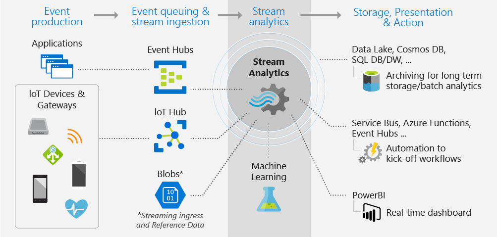

# Introduction

# Introduction

### Use cases for the Cloud

Web: Azure Cosmos DB a NoSQL DB

Big Data: Azure Databricks

IoT: Azure IoT Hub

Azure Storage offers four configuration options:

- **Azure Blob**: A scalable object store for text and binary data
- **Azure Files**: Managed file shares for cloud or on-premises deployments
- **Azure Queue**: A messaging store for reliable messaging between application components
- **Azure Table**: A NoSQL store for no-schema storage of structured data

### Azure Data Lake Storage

- Azure Data Lake Storage is a Hadoop-compatible data repository that can store any size or type of data.
- Gen2 is designed to store massive amounts of data for big-data analytics.
- To ingest data into your system, use Azure Data Factory, Apache Sqoop, Azure Storage Explorer, the AzCopy tool, PowerShell, or Visual Studio.

### Azure Sream Analytics

- IoT
- Stream Data like Kafka

### Azure HDInsight

HDInsight is a low-cost cloud solution. It includes Apache Hadoop, Spark, Kafka, HBase, Storm, and Interactive Query.

- **Hadoop** includes Apache Hive, HBase, Spark, and Kafka. Hadoop stores data in a file system (HDFS). Spark stores data in memory. This difference in storage makes Spark about 100 times faster.
- **HBase** is a NoSQL database built on Hadoop. It's commonly used for search engines. HBase offers automatic failover.
- **Storm** is a distributed real-time streamlining analytics solution.
- **Kafka** is an open-source platform that's used to compose data pipelines. It offers message queue functionality, which allows users to publish or subscribe to real-time data streams.

### Holistic Data Engineering

Contoso Health Network recently deployed IoT devices to its intensive care unit (ICU). 

- Here are the goals of the project:
    - Capture data on patient biometric monitoring in real time to help physicians treat their patients.
    - Store the biometric data so that Contoso's research center can further analyze it in the future.
    - Use Azure Machine Learning to understand which treatments improve the quality of care and reduce the likelihood that a patient will be readmitted to the hospital.
    - Create a visualization of the data's history for Contoso's chief medical officer.
- After reviewing the business case, Contoso's technical architect proposes the following technologies:
    - **Azure IoT Hub** to capture real-time data from the ICU's IoT devices.
    - **Azure Stream Analytics** to stream and enrich the IoT data, to create windows and aggregations, and to integrate Azure Machine Learning.
    - **Azure Data Lake Storage Gen2** to store the biometric data at high speed.
    - **Azure Data Factory** to perform the extract, load, transform, and load (ELTL) process to move the data from the data lake store to Azure SQL Data Warehouse.
    - **Azure SQL Data Warehouse** to provide data warehousing services to support the chief medical officer's needs.
    - **Power BI** to create the patient dashboard. Part of the dashboard will show real-time telemetry about the patient's condition. The other part will show the patient's recent history.
    - **Azure Machine Learning** to process both raw and aggregated data. Researchers will use this to perform predictive analytics on patient readmittance.

Contoso's data engineer creates a work plan to implement the ELTL operations. The plan includes a provisioning workflow and a holistic workflow.

- The provisioning workflow:
    1. Provision Azure Data Lake Storage Gen2.
    2. Provision Azure SQL Data Warehouse.
    3. Provision Azure IoT Hub.
    4. Provision Azure Stream Analytics.
    5. Provision Azure Machine Learning.
    6. Provision Azure Data Factory.
    7. Provision Power BI.
- The holistic workflow:
    1. Set up Azure IoT Hub to capture data from the ICU IoT devices.
    2. Connect Azure IoT Hub to Azure Stream Analytics. Set up window-creation functions for the ICU data. The functions will aggregate the data for each window. At the same time, set up the IoT Hub to move the streaming data to Azure Data Lake Storage by using Azure Functions.
    3. Set up Azure Functions to store the Azure Stream Analytics aggregates in Azure Data Lake Storage Gen2.
    4. Use Azure Data Factory to load data from the data lake into Azure SQL Data Warehouse to support the chief medical officer's needs. After the data is loaded, transformations can occur within Azure SQL Data Warehouse.
    5. In parallel, connect the Azure Machine Learning service to Azure Data Lake Storage to perform predictive analytics.
    6. Connect Power BI to Stream Analytics to pull the real-time aggregates for the patient data. Connect SQL Data Warehouse to pull the historical data to create a combined dashboard.

The following diagram provides a high-level visualization of the solution:

# Azure Fundamentals

These two approaches to investment are referred to as:

- **Capital Expenditure (CapEx)**: CapEx is the spending of money on physical infrastructure up front, and then deducting that expense from your tax bill over time. CapEx is an upfront cost, which has a value that reduces over time.
- **Operational Expenditure (OpEx)**: OpEx is spending money on services or products now and being billed for them now. You can deduct this expense from your tax bill in the same year. There's no upfront cost. You pay for a service or product as you use it.

### Deployment Methods

- **Public**
    - High scalability/agility – you don't have to buy a new server in order to scale
    - Pay-as-you-go pricing – you pay only for what you use, no CapEx costs
    - You're not responsible for maintenance or updates of the hardware
    - Minimal technical knowledge to set up and use - you can leverage the skills and expertise of the cloud provider to ensure workloads are secure, safe, and highly available
- **Private**
    - You can ensure the configuration can support any scenario or legacy application
    - You have control (and responsibility) over security
    - Private clouds can meet strict security, compliance, or legal requirements
- **Hybrid**
    - You can keep any systems running and accessible that use out-of-date hardware or an out-of-date operating system
    - You have flexibility with what you run locally versus in the cloud
    - You can take advantage of economies of scale from public cloud providers for services and resources where it's cheaper, and then supplement with your own equipment when it's not
    - You can use your own equipment to meet security, compliance, or legacy scenarios where you need to completely control the environment

### Infrastructure as a service (IaaS)

- **Migrating workloads.** Typically, IaaS facilities are managed in a similar way as on-premises infrastructure and provide an easy migration path for moving existing applications to the cloud.
- **Test and development.** Teams can quickly set up and dismantle test and development environments, bringing new applications to market faster. IaaS makes scaling development and testing environments, fast and economical.
- **Storage, backup, and recovery.** Organizations avoid the capital outlay and complexity of storage management, which typically requires skilled staff to manage data and meet legal and compliance requirements. IaaS is useful for managing unpredictable demand and steadily growing storage needs. IaaS can also simplify the planning and management of backup and recovery systems.

### Platform as a service (PaaS)

- **Development framework.** PaaS provides a framework that developers can build upon to develop or customize cloud-based applications. Just like Microsoft Excel macro, PaaS lets developers create applications using built-in software components. Cloud features such as scalability, high-availability, and multi-tenant capability are included, reducing the amount of coding that developers must do.
- **Analytics or business intelligence.** Tools provided as a service with PaaS allow organizations to analyze and mine their data. They can find insights and patterns, and predict outcomes to improve business decisions such as forecasting, product design, and investment returns.

### Software as a service (Saas)

SaaS is software that is centrally hosted and managed for the end customer. It is usually based on an architecture where one version of the application is used for all customers, and licensed through a monthly or annual subscription. Office 365, Skype, and Dynamics CRM Online are perfect examples of SaaS software.

